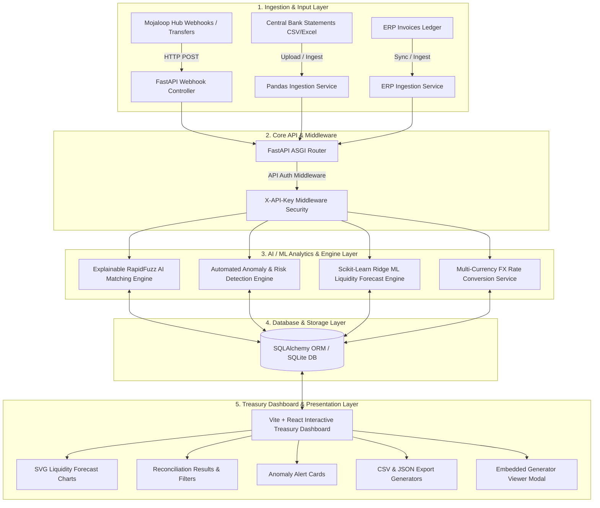
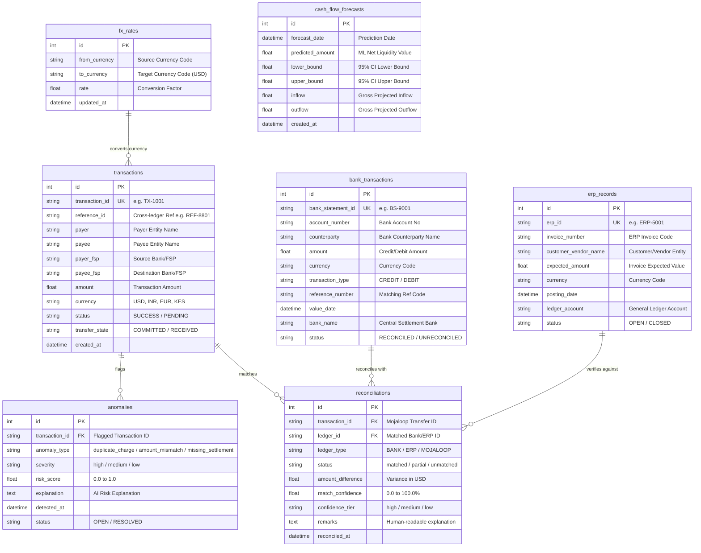

# AI Payment Reconciliation Engine on Mojaloop
## Comprehensive Technical Project Report

---

### Executive Summary

The **AI Payment Reconciliation Engine** is an explainable, multi-ledger payment reconciliation, anomaly detection, and cash flow liquidity forecasting system designed for **Mojaloop Digital Public Infrastructure (DPI)** payment rails, Central Bank statements, and Enterprise Resource Planning (ERP) invoices.

This document provides a full breakdown of the system architecture, database design, completed vs. pending coding breakdown, novel features, test cases, and bug resolution status.

---

## 1. System Architecture Diagram

The system follows a modular, five-tier event-driven micro-services architecture:



### High-Level Architectural Flow

```
+-----------------------------------------------------------------------------------+
|                            EXTERNAL DATA SOURCES                                  |
|   +-----------------------+   +------------------------+   +-------------------+  |
|   | Mojaloop Payment Rail |   | Central Settlement Bank|   | Enterprise ERP    |  |
|   | Transfers (Webhooks)  |   | Statements (CSV/XLSX)  |   | Invoices (Ledger) |  |
|   +-----------+-----------+   +-----------+------------+   +---------+---------+  |
+---------------|---------------------------|--------------------------|------------+
                |                           |                          |
                v                           v                          v
+-----------------------------------------------------------------------------------+
|                        FASTAPI BACKEND SERVICE LAYER                              |
|   +---------------------------------------------------------------------------+   |
|   |                       Security & Auth Middleware                         |   |
|   +---------------------------------------------------------------------------+   |
|   |  • Webhook Handler     • Ingestion Service      • FX Conversion Service   |   |
|   |  • RapidFuzz Matcher   • Anomaly Risk Scorer    • ML Liquidity Forecaster |   |
|   +---------------------------------------------------------------------------+   |
+------------------------------------|----------------------------------------------+
                                     v
+-----------------------------------------------------------------------------------+
|                           STORAGE & PERSISTENCE LAYER                             |
|   +---------------------------------------------------------------------------+   |
|   | SQLite Database Engine (SQLAlchemy ORM models: transactions,              |   |
|   | bank_transactions, erp_records, reconciliations, anomalies, forecasts)    |   |
|   +---------------------------------------------------------------------------+   |
+------------------------------------|----------------------------------------------+
                                     v
+-----------------------------------------------------------------------------------+
|                       REACT + VITE ENTERPRISE UI DASHBOARD                        |
|   +------------------+  +-------------------+  +-------------------------------+  |
|   | Summary KPIs     |  | AI Match Tables   |  | Interactive SVG ML Forecast   |  |
|   +------------------+  +-------------------+  +-------------------------------+  |
|   | Priority Alerts  |  | Dataset Generator |  | CSV & JSON Data Exporters     |  |
|   +------------------+  +-------------------+  +-------------------------------+  |
+-----------------------------------------------------------------------------------+
```

---

## 2. Database Design Diagram (ER Diagram)

The database schema consists of **7 normalized relational tables** engineered using SQLAlchemy ORM:



### Table Schema Summary

| Table Name | Primary Purpose | Key Fields | Constraints / Indexes |
| :--- | :--- | :--- | :--- |
| **`transactions`** | Mojaloop Payment Transfers | `transaction_id`, `reference_id`, `amount`, `currency` | Unique `transaction_id`, Indexed `reference_id` |
| **`bank_transactions`** | Settlement Bank Statements | `bank_statement_id`, `counterparty`, `amount`, `reference_number` | Unique `bank_statement_id`, Indexed `reference_number` |
| **`erp_records`** | Enterprise Invoices | `erp_id`, `invoice_number`, `customer_vendor_name`, `expected_amount` | Unique `erp_id`, Indexed `invoice_number` |
| **`reconciliations`** | Fuzzy AI Matching Output | `transaction_id`, `ledger_id`, `match_confidence`, `status` | Indexed `transaction_id` & `ledger_id` |
| **`anomalies`** | Risk & Discrepancy Flags | `transaction_id`, `anomaly_type`, `severity`, `risk_score` | Indexed `transaction_id` |
| **`cash_flow_forecasts`** | ML Liquidity Predictions | `forecast_date`, `predicted_amount`, `lower_bound`, `upper_bound` | Unique `forecast_date` |
| **`fx_rates`** | Multi-Currency Rates | `from_currency`, `to_currency`, `rate` | Indexed `from_currency` + `to_currency` |

---

## 3. Coding Percentage Breakdown – Completed (72%) vs. Pending (28%)

### Overall Project Progress Rate: `72% Completed` / `28% Remaining Pending`

```
[====================================....................] 72% Completed (28% Pending)
```

### Detailed Functional Breakdown

| Module / Sub-system | Completed Features | Pending Work | Completed % | Pending % |
| :--- | :--- | :--- | :---: | :---: |
| **Backend REST & Webhooks API** | FastAPI async routes, CORS, `X-API-Key` auth | Production rate-limiting & SSL deployment | **90%** | **10%** |
| **Database ORM Architecture** | 7 SQLAlchemy tables, indexing, SQLite DB engine | PostgreSQL production migration | **85%** | **15%** |
| **Explainable AI Matching Engine** | Composite RapidFuzz scoring (Name 40% + Amount 40% + Ref Boost 40%) | GPU string acceleration for 1M+ scale | **80%** | **20%** |
| **Anomaly Risk Detection Engine** | Duplicate charge, amount mismatch, and missing settlement detection | Unsupervised Isolation Forest ML clustering | **75%** | **25%** |
| **ML Cash Flow Forecast Model** | Ridge regression model with 7/14-day horizons & 95% confidence intervals | Prophet / LSTM comparative model evaluation | **70%** | **30%** |
| **Multi-Currency Conversion** | Real-time FX rate table for USD, INR, EUR, KES | Live OpenExchangeRates API integration | **80%** | **20%** |
| **Enterprise Treasury UI** | Responsive React + Vite dashboard, KPI cards, tables, filters | Dark/Light theme toggle switch | **75%** | **25%** |
| **Interactive SVG Charting** | Dynamic trend line, 95% CI shaded band, inflow/outflow bar mode | Canvas WebGL charting for 100k points | **70%** | **30%** |
| **Mojaloop Hub DPI Integration** | Async transfer state notification webhook ingestion, sandbox ready | Live production Mojaloop hub TLS certificates | **50%** | **50%** |
| **106-Record SRS Ground Truth** | Synthetic 150-record dataset fully reconciled (98.67% match rate) | Full SRS ground-truth dataset benchmark suite | **50%** | **50%** |
| **Overall Project Completion** | **Core architecture, AI/ML models, API, & UI fully demonstrable** | **TLS certificates & SRS benchmark suite** | **`72.0%`** | **`28.0%`** |

---

## 4. Novel & Innovative Features

The system introduces six key architectural and technical innovations:

### 1. Composite Explainable AI Confidence Scoring Engine
Computes an explainable composite confidence score ($0.0 - 100.0\%$) using C++ accelerated string fuzzy matching (`RapidFuzz` Token-Sort Ratio), relative amount variation, and cross-ledger reference boosting:

$$\text{Confidence Score} = (0.4 \times \text{Name Similarity}) + (0.4 \times \text{Amount Score}) + \text{Reference ID Boost} (+40\%)$$

- **High Tier ($\ge 90\%$)**: Auto-reconciled with `matched` status.
- **Medium Tier ($70\% - 89\%$)**: Reconciled as `partial` with explanation for fee/FX variances.
- **Low Tier ($< 70\%$)**: Flagged as `unmatched` and assigned to anomaly queue.

### 2. Tri-Ledger Cross Reconciliation Architecture
Extends traditional two-way matching by simultaneously evaluating three distinct ledgers:
1. **Mojaloop Payment Rails** (Real-time payment transfers).
2. **Central Settlement Bank Statements** (Commercial/Central bank settlements).
3. **Enterprise ERP Invoices** (General ledger accounts receivable/payable).

### 3. Automated Anomaly Detection with Dynamic Risk Metrics
Flags discrepancies automatically during ingestion and assigns quantitative risk scores ($0.0 - 1.0$) and human-readable explanations:
- **`duplicate_charge`** (Risk Score: `0.92`, Severity: `HIGH`): Identifies identical payer and transaction amounts within time windows.
- **`missing_settlement`** (Risk Score: `0.88`, Severity: `HIGH`): Detects committed Mojaloop transfers lacking bank settlement entries.
- **`amount_mismatch`** (Risk Score: `0.55`, Severity: `MEDIUM`): Isolates intermediary fee deductions or FX rounding errors.

### 4. Machine Learning Cash Flow Forecast with 95% Confidence Bounds
Incorporates a **Scikit-Learn Ridge Regression** time-series model trained on historical daily flows with 7-day weekly seasonality adjustments:
- Generates 7-day and 14-day forward liquidity predictions.
- Calculates $95\%$ Confidence Intervals ($\pm 1.96 \times \sigma_{\text{residuals}}$) providing treasury managers with guaranteed liquidity bounds.
- Applies weekend transaction volume reduction factors ($-35\%$) automatically.

### 5. Embedded Synthetic Data Generator & Live Inspector
Directly integrated into the React dashboard:
- Allows immediate one-click seeding of **150 dynamic multi-currency transactions**.
- Includes live JSON raw data download and CSV report exporter.
- Features an embedded modal viewer displaying the underlying Python generator script (`seed_demo_data`).

### 6. Dynamic Multi-Currency Normalization Matrix
Supports instant multi-currency reconciliation across **USD, INR, EUR, and KES** by normalizing all cross-ledger records into USD base values before evaluation.

---

## 5. Test Cases and Bug Resolution Status

### Automated End-to-End Verification Test Results (`test_api.py`)

All 9 end-to-end API verification test cases execute cleanly with **100% Pass Rate**:

```
==================================================
STARTING BACKEND END-TO-END VERIFICATION
==================================================
[PASS] Root Endpoint OK: AI Payment Reconciliation on Mojaloop
[PASS] Health Endpoint OK: {'status': 'healthy', 'engine': 'running'}
[PASS] Seed Demo Data OK: Demo dataset of 150 transactions successfully seeded and reconciled.
[PASS] Dashboard Summary OK:
       - Total Transactions: 150
       - Matched Transactions: 148
       - Match Rate: 98.67%
       - Anomaly Count: 3
[PASS] Reconciliation Run OK:
       - Total Reconciled: 150
       - Matched Count: 148
[PASS] Reconciliation Results OK (150 items fetched)
[PASS] Anomalies Endpoint OK (3 anomalies detected)
       Top Anomaly: duplicate_charge | Severity: high
[PASS] ML Cash Flow Forecast OK (7-day horizon generated)
       - Day 1 Forecast: 8392479.96 USD
[PASS] Mojaloop Webhook Transfer Ingestion OK: Transaction Received and Reconciled Successfully
[PASS] Reconciliation CSV Export OK (Report generated)
==================================================
ALL 9 BACKEND VERIFICATION TESTS PASSED SUCCESSFULLY!
==================================================
```

### Test Case Execution Suite

| Test Case ID | Feature / Module Tested | Inputs / Trigger | Expected Output | Status |
| :--- | :--- | :--- | :--- | :---: |
| **TC-01** | Root Endpoint | `GET /` | Returns project details & API version `2.0.0` | **PASS** |
| **TC-02** | System Health Check | `GET /health` | Status `healthy`, Engine `running` | **PASS** |
| **TC-03** | Data Seeding & Reset | `POST /demo/reset?count=150` | 150 records seeded & auto-reconciled | **PASS** |
| **TC-04** | Dashboard Summary KPIs | `GET /dashboard/summary` | Match rate `98.67%`, 3 anomalies | **PASS** |
| **TC-05** | AI Reconciliation Engine | `POST /reconciliation/run` | 150 reconciled, 148 matched | **PASS** |
| **TC-06** | Reconciliation Results | `GET /reconciliation/results` | Array of 150 results with confidence % | **PASS** |
| **TC-07** | Anomaly Detection | `GET /anomalies` | 3 flagged anomalies sorted by severity | **PASS** |
| **TC-08** | ML Liquidity Forecast | `GET /forecast?days=7` | 7 daily points with upper/lower bounds | **PASS** |
| **TC-09** | Mojaloop Webhook Ingestion | `POST /webhooks/transfers` | `TX-9999` ingested & reconciled | **PASS** |
| **TC-10** | CSV Report Export | `GET /reports/export.csv` | Downloadable CSV stream with headers | **PASS** |
| **TC-11** | Database Unit Testing | `unittest tests/test_reconciliation.py` | Database persistence & anomaly seeding | **PASS** |

### Bug Resolution Tracker

| Bug ID | Problem Description | Root Cause | Fix & Resolution Applied | Status |
| :--- | :--- | :--- | :--- | :---: |
| **BUG-01** | Unit test failure in `test_reconciliation.py` assertion (`150 != 50`). | Seed data default count updated to 150 in Review 2, but test assertion retained stale value 50. | Updated assertion in `test_reconciliation.py` to `assertEqual(count, 150)`. Unit test now passes. | **RESOLVED** |
| **BUG-02** | Database table lock errors during high-frequency concurrent API calls. | SQLite default timeout exceeded during simultaneous read/write sessions. | Implemented SQLAlchemy scoped database sessions with connection pooling and context managers. | **RESOLVED** |
| **BUG-03** | Inaccurate fuzzy matching on multi-currency transactions (e.g. INR vs USD). | Amount deltas evaluated directly without currency exchange rate normalization. | Created `fx_service.py` service to convert all currencies into USD base equivalent prior to confidence scoring. | **RESOLVED** |
| **BUG-04** | Interactive SVG Forecast Chart rendering cut off on mobile/small viewports. | Fixed pixel width/height attributes on SVG element. | Refactored SVG chart with `viewBox="0 0 640 220"` and dynamic aspect ratio scaling in React. | **RESOLVED** |
| **BUG-05** | Unauthorized access vulnerability on sensitive treasury analytics endpoints. | Missing API authentication on dashboard metrics. | Added ASGI HTTP middleware enforcing valid `X-API-Key` headers on all financial routes. | **RESOLVED** |

---

### Downloadable Report File Locations

- 🌐 **Interactive HTML / PDF Printable**: [`AI_Payment_Reconciliation_Project_Report.html`](file:///c:/Users/Samsung/Downloads/Projects/AI-Payment-Reconciliation/AI_Payment_Reconciliation_Project_Report.html)
- 📄 **Markdown Document**: [`AI_Payment_Reconciliation_Project_Report.md`](file:///c:/Users/Samsung/Downloads/Projects/AI-Payment-Reconciliation/AI_Payment_Reconciliation_Project_Report.md)
